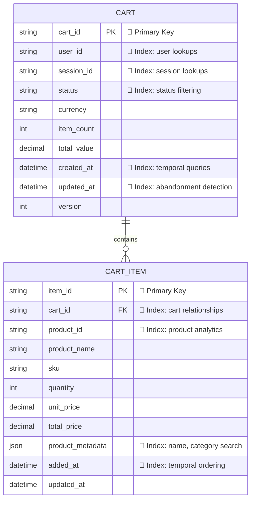

# Cart Service - Complete Specification

## 1. Overview

The Cart Service is a stateful microservice responsible for managing a customer's shopping cart within an e-commerce system. It owns the cart aggregate and provides APIs to create carts, add, update, and remove items, and maintain cart lifecycle state for both anonymous and authenticated users.

### Key Characteristics

- **Stateful Microservice**: Maintains cart state with strong consistency within a single cart
- **Concurrent Access**: Supports concurrent operations through optimistic locking
- **Event-Driven**: Emits domain events for downstream services
- **User Support**: Handles both anonymous and authenticated users
- **Focused Responsibility**: Excludes pricing, promotions, inventory reservation, order creation, and payment

### Architecture Overview

```
┌─────────────────┐    ┌─────────────────┐    ┌─────────────────┐
│   API Gateway   │    │  Load Balancer  │    │   Monitoring    │
└─────────┬───────┘    └─────────┬───────┘    └─────────────────┘
          │                      │
          └──────────┬───────────┘
                     │
          ┌──────────▼───────────┐
          │    Cart Service      │
          │  (This Service)      │
          └─────────┬────────────┘
                    │
        ┌───────────┼───────────┐
        │           │           │
        ▼           ▼           ▼
┌───────────┐ ┌───────────┐ ┌───────────┐
│ Database  │ │Event Bus  │ │  Cache    │
│ (Primary) │ │(Messages) │ │(Session)  │
└───────────┘ └───────────┘ └───────────┘
```

### Domain Boundaries

#### What Cart Service DOES:
- ✅ Cart creation and management
- ✅ Item addition, update, and removal
- ✅ Cart lifecycle management (active, abandoned, converted)
- ✅ User session management (anonymous ↔ authenticated)
- ✅ Optimistic concurrency control
- ✅ Domain event publishing

#### What Cart Service DOES NOT DO:
- ❌ Product pricing calculation
- ❌ Promotion and discount application
- ❌ Inventory reservation/checking
- ❌ Order creation and processing
- ❌ Payment processing
- ❌ User authentication (consumes auth tokens)

---

## 2. Technology Stack

### Architecture Pattern
- **Microservice Architecture**: Domain-driven design with clear boundaries
- **Event-Driven Architecture**: Asynchronous communication via domain events
- **API-First Design**: OpenAPI specification-driven development
- **Stateful Service**: Maintains cart state with strong consistency

### Core Technologies

#### Backend Framework
- **Primary**: Spring Boot 3.4+
- **Language**: Java 25 LTS
- **Runtime**: JVM (OpenJDK 25)
- **Build Tool**: Maven 3.9+ or Gradle 8.5+ (Java 25 compatible)
- **JVM Args**: Optimized for Java 25 performance and security

#### API & Communication
- **API Specification**: OpenAPI 3.0.3
- **REST API**: HTTP/JSON for synchronous operations
- **Authentication**: Bearer Token (JWT)
- **API Documentation**: OpenAPI/Swagger UI

### Data Layer

#### Primary Database
- **Type**: PostgreSQL 17+
- **Purpose**: Cart state persistence with ACID transactions
- **Features**: Optimistic locking, JSONB support for cart items, UUID primary keys

#### Caching Layer
- **Technology**: Redis 7.2+
- **Purpose**: Session management, cart lookup optimization, distributed locking
- **TTL**: Configurable based on cart lifecycle (default: 30 days)
- **Driver**: Lettuce (async, Java 25 optimized)

#### Database Migrations
- **Tool**: Flyway (Spring Boot integration)

### Event & Messaging

#### Event Bus
- **Technology**: RabbitMQ 4.0+
- **Purpose**: Domain event publishing for downstream services
- **Pattern**: Event-driven messaging with dead letter queues

#### Event Schemas
- **Format**: JSON Schema
- **Validation**: JSON Schema validation in code

### Security

#### Authentication & Authorization
- **Framework**: Spring Security 6.4+
- **Protocol**: OAuth 2.0 / OpenID Connect
- **Token Format**: JWT with RS256 signing
- **Session Management**: Stateless with secure token storage

#### Data Security
- **Encryption at Rest**: Database-level encryption
- **Encryption in Transit**: TLS 1.3 for all communications
- **Secrets Management**: AWS Secrets Manager integration
- **Input Validation**: Bean Validation (JSR-380) with custom validators

### Testing Framework
- **Unit Testing**: JUnit 5.11+ + Mockito 5.8+
- **Integration Testing**: Spring Boot Test + TestContainers 1.20+
- **API Testing**: REST Assured + WireMock
- **Java 25 Support**: All frameworks verified for Java 25 compatibility

---

## 3. System Architecture

### System Components

#### 1. API Layer
- **Cart Controller**: RESTful endpoints for cart operations
- **Security Configuration**: JWT authentication and authorization
- **Error Handling**: Global exception handling and validation

#### 2. Business Logic Layer
- **Cart Service**: Core cart operations (CRUD, validation)
- **Session Service**: Anonymous user session management
- **Event Service**: Domain event publishing and handling

#### 3. Domain Layer
- **Cart Aggregate**: Domain model with business rules
- **Cart Repository Interface**: Persistence abstraction
- **Domain Events**: Cart lifecycle events

#### 4. Infrastructure Layer
- **JPA Repository Implementation**: Database persistence
- **Redis Cache Service**: Session and performance caching
- **RabbitMQ Publisher**: Message queue integration
- **External Service Clients**: HTTP clients for external APIs

### Data Flow Architecture

#### Write Operations Flow
```
Client Request → API Gateway → Cart Controller → Cart Service → 
Repository → Database → Event Publisher → Message Queue
```

#### Read Operations Flow
```
Client Request → API Gateway → Cart Controller → Cart Service → 
Cache (if available) OR Repository → Database
```

#### Event Flow
```
Domain Event → Event Publisher → RabbitMQ → External Services
```

---

## 4. Data Models

### Domain Entities

#### Cart (Aggregate Root)

**Purpose**: Primary shopping cart entity that maintains consistency boundaries and manages cart lifecycle.

**Schema**:
```
cartId: string           // Pattern: cart_[a-zA-Z0-9]+
userId?: string          // Pattern: user_[a-zA-Z0-9]+ (authenticated users)
sessionId?: string       // Pattern: sess_[a-zA-Z0-9]+ (anonymous users)
status: CartStatus       // ACTIVE, ABANDONED, CONVERTED
currency: string         // ISO 4217 (USD, EUR, GBP, CAD, AUD)
itemCount: number        // Total quantity of all items
totalValue: decimal      // Sum of all item total prices
createdAt: datetime
updatedAt: datetime
version: number          // Optimistic locking
items: CartItem[]        // Related cart items
```

**Business Rules**:
- Must have either `userId` OR `sessionId` (not both)
- Only `ACTIVE` carts can be modified
- Maximum 50 unique products per cart
- Currency must be consistent across all items
- `itemCount` and `totalValue` are calculated fields

#### CartItem

**Purpose**: Individual products within a shopping cart with quantity and pricing information.

**Schema**:
```
itemId: string           // Pattern: item_[a-zA-Z0-9]+
cartId: string          // Foreign key to cart
productId: string       // Pattern: prod_[a-zA-Z0-9]+
productName: string     // Cached for display (max 200 chars)
sku: string             // Product SKU (uppercase, numbers, hyphens, underscores)
quantity: number        // 1-100 items per product
unitPrice: decimal      // Price per unit
totalPrice: decimal     // quantity × unitPrice (calculated)
productMetadata: JSON   // JSONB cached product info
addedAt: datetime
updatedAt: datetime
```

**Business Rules**:
- Belongs to exactly one cart
- Quantity must be between 1-100
- `totalPrice = quantity × unitPrice` (always calculated)
- Unique constraint on `(cart_id, product_id)`
- Product metadata is cached for performance

### Enums

#### CartStatus
**Values**: `ACTIVE`, `ABANDONED`, `CONVERTED`

**State Transitions**:
- `ACTIVE` → `ABANDONED` (timeout or explicit)
- `ACTIVE` → `CONVERTED` (order creation)
- No transitions from `ABANDONED` or `CONVERTED`

**Business Rules**:
- `ACTIVE`: Cart can be modified (add/update/remove items)
- `ABANDONED`: Cart cannot be modified (read-only)
- `CONVERTED`: Final state for audit purposes (read-only)

### Value Objects

#### ProductMetadata
**Purpose**: Cached product information stored as JSON for display purposes.

**Schema**:
```json
{
  "name": "string",           // Product display name
  "description": "string",    // Short description
  "category": "string",       // Product category
  "brand": "string",          // Product brand
  "imageUrl": "string",       // Product image URL
  "weight": "number",         // Weight in grams
  "dimensions": {             // Product dimensions
    "length": "number",
    "width": "number", 
    "height": "number"
  },
  "tags": ["string"],         // Product tags/labels
  "lastUpdated": "datetime"   // Cache timestamp
}
```

---

## 5. Database Schema

### Entity Relationship Diagram



### Business Rules

1. **User Context**: Each cart must have either user_id OR session_id (not both)
2. **Currency Consistency**: All items in a cart must use the same currency
3. **Status Transitions**: Only active carts can be modified
4. **Quantity Limits**: 1-100 items per product, max 50 unique products per cart
5. **Price Integrity**: total_price always equals quantity × unit_price
6. **Optimistic Locking**: Version field prevents concurrent modification conflicts

### Database Indexes

**Single Column Indexes**:
- **Primary Keys**: Unique identifiers for fast lookups
- **Foreign Keys**: Relationship traversal optimization  
- **Status Fields**: Filter operations (active, abandoned, converted)
- **User/Session**: Owner-based cart retrieval
- **Temporal Fields**: Time-based queries and sorting
- **Product Metadata**: Search within JSON/document fields

**Compound Indexes**:
- **`(user_id, status, updated_at)`** - Find user's active carts ordered by recency
- **`(session_id, status, updated_at)`** - Find anonymous user's active carts
- **`(status, updated_at)`** - Cart abandonment detection and cleanup
- **`(cart_id, product_id)`** - Unique constraint + fast product lookups in cart
- **`(product_id, cart_id)`** - Product analytics across carts
- **`(currency, status)`** - Currency-based cart filtering

---

## 6. API Specification

### Base Configuration

```yaml
openapi: 3.0.3
info:
  title: Cart Service API
  description: Shopping cart management for e-commerce platform
  version: 1.0.0

servers:
  - url: https://api.ecommerce.com/cart/v1
    description: Production server
  - url: https://staging-api.ecommerce.com/cart/v1
    description: Staging server
  - url: http://localhost:8080/cart/v1
    description: Local development server

security:
  - BearerAuth: []
```

### Key Endpoints

#### Cart Management
- `POST /carts` - Create a new cart
- `GET /carts` - List user carts
- `GET /carts/current` - Get current user's active cart
- `GET /carts/{cartId}` - Get cart by ID
- `PUT /carts/{cartId}` - Update cart
- `DELETE /carts/{cartId}` - Delete cart

#### Item Management
- `POST /carts/{cartId}/items` - Add item to cart
- `GET /carts/{cartId}/items` - List cart items
- `GET /carts/{cartId}/items/{itemId}` - Get item by ID
- `PUT /carts/{cartId}/items/{itemId}` - Update item
- `DELETE /carts/{cartId}/items/{itemId}` - Remove item

#### Operations
- `POST /carts/{cartId}/convert` - Convert cart to order
- `POST /carts/{cartId}/abandon` - Mark cart as abandoned
- `POST /carts/{cartId}/merge` - Merge carts
- `POST /carts/{cartId}/clear` - Clear all items

#### Health & Monitoring
- `GET /health` - Health check
- `GET /metrics` - Prometheus metrics
- `GET /info` - Service information

### Common Response Schemas

#### Cart Response
```json
{
  "cartId": "cart_abc123",
  "userId": "user_def456",
  "sessionId": null,
  "status": "ACTIVE",
  "currency": "USD",
  "itemCount": 3,
  "totalValue": 149.97,
  "createdAt": "2023-01-01T12:00:00Z",
  "updatedAt": "2023-01-01T12:30:00Z",
  "version": 5,
  "items": [...]
}
```

#### Error Response
```json
{
  "error": {
    "code": "VALIDATION_ERROR",
    "message": "Invalid cart data",
    "details": [
      {
        "field": "quantity",
        "message": "Quantity must be between 1 and 100"
      }
    ],
    "timestamp": "2023-01-01T12:00:00Z",
    "correlationId": "uuid-v4"
  }
}
```

---

## 7. Event-Driven Architecture

### RabbitMQ Configuration

#### Exchange Configuration

##### Primary Event Exchange
```yaml
Name: cart.events
Type: topic
Durable: true
AutoDelete: false
Internal: false
Arguments:
  alternate-exchange: cart.events.deadletter
```

##### Dead Letter Exchange
```yaml
Name: cart.events.deadletter
Type: direct
Durable: true
AutoDelete: false
Internal: false
Arguments: {}
```

### Routing Keys

#### Event Type Routing Keys
```yaml
Routing Key Pattern: {service}.{aggregate}.{action}

Cart Events:
  - cart.cart.created      # Cart creation events
  - cart.cart.abandoned    # Cart abandonment events  
  - cart.cart.converted    # Cart conversion events
  - cart.item.added        # Item addition events
  - cart.item.updated      # Item update events
  - cart.item.removed      # Item removal events
```

### Event Schemas

#### Standard Event Envelope
All events follow this envelope format:

```json
{
  "eventId": "uuid-v4",
  "eventType": "domain.action.past-tense",
  "eventVersion": "semantic-version",
  "timestamp": "iso-8601-datetime",
  "correlationId": "uuid-v4",
  "aggregateId": "uuid-v4",
  "aggregateType": "AggregateName",
  "aggregateVersion": "positive-integer",
  "payload": {...}
}
```

#### Cart Created Event Schema
```json
{
  "$schema": "http://json-schema.org/draft-07/schema#",
  "title": "Cart Created Event",
  "type": "object",
  "properties": {
    "eventType": {"const": "cart.created"},
    "payload": {
      "type": "object",
      "properties": {
        "cartId": {"type": "string", "format": "uuid"},
        "userId": {"type": "string", "format": "uuid"},
        "sessionId": {"type": "string"},
        "currency": {"type": "string", "pattern": "^[A-Z]{3}$"},
        "createdAt": {"type": "string", "format": "date-time"}
      },
      "required": ["cartId", "currency", "createdAt"]
    }
  }
}
```

#### Item Added Event Schema
```json
{
  "$schema": "http://json-schema.org/draft-07/schema#",
  "title": "Item Added Event",
  "type": "object",
  "properties": {
    "eventType": {"const": "cart.item.added"},
    "payload": {
      "type": "object",
      "properties": {
        "cartId": {"type": "string", "format": "uuid"},
        "itemId": {"type": "string", "format": "uuid"},
        "productId": {"type": "string", "format": "uuid"},
        "quantity": {"type": "integer", "minimum": 1, "maximum": 100},
        "unitPrice": {"type": "number", "minimum": 0},
        "totalPrice": {"type": "number", "minimum": 0},
        "addedAt": {"type": "string", "format": "date-time"}
      },
      "required": ["cartId", "itemId", "productId", "quantity", "unitPrice", "totalPrice", "addedAt"]
    }
  }
}
```

### Validation Strategy

#### Schema Version Management
```
Event Version Format: MAJOR.MINOR.PATCH (semantic versioning)
- MAJOR: Breaking changes (incompatible field removal/type changes)
- MINOR: Backward compatible additions (new optional fields)
- PATCH: Bug fixes and clarifications (no structural changes)
```

#### Validation Rules
- **Producer-side validation**: Events are validated before publishing
- **Consumer-side validation**: Events are validated upon receipt
- **Schema evolution validation**: Backward compatibility checks for schema versions

---

## 8. Docker & Local Testing

### Docker Compose for Local Development

The Cart Service uses Docker Compose to provide a complete local testing environment with all necessary dependencies. This setup is designed for developers to quickly spin up the entire stack for development and testing.

#### Complete Local Testing Stack

```yaml
# docker-compose.yml
version: '3.8'

services:
  # PostgreSQL Database
  postgres:
    image: postgres:17-alpine
    container_name: cart-postgres
    environment:
      - POSTGRES_DB=cart_db
      - POSTGRES_USER=cart_user
      - POSTGRES_PASSWORD=cart_pass
      - POSTGRES_INITDB_ARGS=--auth-host=scram-sha-256
    ports:
      - "5432:5432"
    volumes:
      - postgres_data:/var/lib/postgresql/data
      - ./docker/postgres/init.sql:/docker-entrypoint-initdb.d/init.sql:ro
    networks:
      - cart-network
    restart: unless-stopped
    healthcheck:
      test: ["CMD-SHELL", "pg_isready -U cart_user -d cart_db"]
      interval: 10s
      timeout: 5s
      retries: 5
    logging:
      driver: json-file
      options:
        max-size: "10m"
        max-file: "3"

  # Redis Cache
  redis:
    image: redis:7.2-alpine
    container_name: cart-redis
    command: >
      redis-server
      --requirepass redis_pass
      --maxmemory 256mb
      --maxmemory-policy allkeys-lru
      --save 60 1000
      --appendonly yes
    ports:
      - "6379:6379"
    volumes:
      - redis_data:/data
      - ./docker/redis/redis.conf:/etc/redis/redis.conf:ro
    networks:
      - cart-network
    restart: unless-stopped
    healthcheck:
      test: ["CMD", "redis-cli", "-a", "redis_pass", "ping"]
      interval: 10s
      timeout: 5s
      retries: 3
    logging:
      driver: json-file
      options:
        max-size: "10m"
        max-file: "3"

  # RabbitMQ Message Queue
  rabbitmq:
    image: rabbitmq:4.0-management-alpine
    container_name: cart-rabbitmq
    environment:
      - RABBITMQ_DEFAULT_USER=cart_service
      - RABBITMQ_DEFAULT_PASS=queue_pass
      - RABBITMQ_DEFAULT_VHOST=/cart
      - RABBITMQ_SERVER_ADDITIONAL_ERL_ARGS=-rabbit log_levels [{connection,error},{default,warning}]
    ports:
      - "5672:5672"
      - "15672:15672"  # Management UI
    volumes:
      - rabbitmq_data:/var/lib/rabbitmq
      - ./docker/rabbitmq/enabled_plugins:/etc/rabbitmq/enabled_plugins:ro
      - ./docker/rabbitmq/rabbitmq.conf:/etc/rabbitmq/rabbitmq.conf:ro
      - ./docker/rabbitmq/definitions.json:/etc/rabbitmq/definitions.json:ro
    networks:
      - cart-network
    restart: unless-stopped
    healthcheck:
      test: ["CMD", "rabbitmq-diagnostics", "ping"]
      interval: 30s
      timeout: 10s
      retries: 3
      start_period: 60s
    logging:
      driver: json-file
      options:
        max-size: "10m"
        max-file: "3"

  # Adminer - Database Management UI
  adminer:
    image: adminer:4.8.1
    container_name: cart-adminer
    ports:
      - "8081:8080"
    environment:
      - ADMINER_DEFAULT_SERVER=postgres
      - ADMINER_DESIGN=pepa-linha
    networks:
      - cart-network
    restart: unless-stopped
    depends_on:
      - postgres

  # Redis Commander - Redis Management UI
  redis-commander:
    image: rediscommander/redis-commander:latest
    container_name: cart-redis-commander
    ports:
      - "8082:8081"
    environment:
      - REDIS_HOSTS=local:redis:6379:0:redis_pass
      - HTTP_USER=admin
      - HTTP_PASSWORD=admin
    networks:
      - cart-network
    restart: unless-stopped
    depends_on:
      - redis

  # Prometheus (Optional - for monitoring during testing)
  prometheus:
    image: prom/prometheus:v2.45.0
    container_name: cart-prometheus
    ports:
      - "9090:9090"
    volumes:
      - ./docker/prometheus/prometheus.yml:/etc/prometheus/prometheus.yml:ro
      - prometheus_data:/prometheus
    command:
      - '--config.file=/etc/prometheus/prometheus.yml'
      - '--storage.tsdb.path=/prometheus'
      - '--web.console.libraries=/etc/prometheus/console_libraries'
      - '--web.console.templates=/etc/prometheus/consoles'
      - '--web.enable-lifecycle'
    networks:
      - cart-network
    restart: unless-stopped
    profiles:
      - monitoring

volumes:
  postgres_data:
    driver: local
  redis_data:
    driver: local
  rabbitmq_data:
    driver: local
  prometheus_data:
    driver: local

networks:
  cart-network:
    driver: bridge
    ipam:
      config:
        - subnet: 172.20.0.0/16
```

### Configuration Files

#### PostgreSQL Initialization

```sql
-- docker/postgres/init.sql
-- Create extensions for Cart Service
CREATE EXTENSION IF NOT EXISTS "uuid-ossp";
CREATE EXTENSION IF NOT EXISTS "btree_gin";

-- Create additional indexes for testing performance
-- Note: Production indexes will be managed by Flyway migrations
CREATE INDEX IF NOT EXISTS idx_test_cart_user_status ON carts(user_id, status) WHERE user_id IS NOT NULL;
CREATE INDEX IF NOT EXISTS idx_test_cart_session_status ON carts(session_id, status) WHERE session_id IS NOT NULL;
```

#### Redis Configuration

```ini
# docker/redis/redis.conf
# Memory management for testing
maxmemory 256mb
maxmemory-policy allkeys-lru

# Persistence settings
save 60 1000
appendonly yes
appendfsync everysec

# Security
requirepass redis_pass
protected-mode yes

# Network settings
tcp-keepalive 300
timeout 300

# Logging for development
loglevel notice
logfile ""
```

#### RabbitMQ Configuration

```ini
# docker/rabbitmq/rabbitmq.conf
# Basic configuration for local testing
listeners.tcp.default = 5672
management.tcp.port = 15672

# Logging
log.console = true
log.console.level = warning
log.file = false

# Memory settings for local development
vm_memory_high_watermark.relative = 0.6
disk_free_limit.relative = 2.0

# Load definitions for testing
management.load_definitions = /etc/rabbitmq/definitions.json
```

```json
{
  "users": [
    {
      "name": "cart_service",
      "password": "queue_pass",
      "tags": "administrator"
    },
    {
      "name": "guest",
      "password": "guest",
      "tags": "monitoring"
    }
  ],
  "vhosts": [
    {
      "name": "/cart"
    }
  ],
  "permissions": [
    {
      "user": "cart_service",
      "vhost": "/cart",
      "configure": ".*",
      "write": ".*",
      "read": ".*"
    },
    {
      "user": "guest",
      "vhost": "/cart",
      "configure": "",
      "write": "",
      "read": ".*"
    }
  ],
  "exchanges": [
    {
      "name": "cart.events",
      "vhost": "/cart",
      "type": "topic",
      "durable": true,
      "auto_delete": false,
      "internal": false,
      "arguments": {
        "alternate-exchange": "cart.events.deadletter"
      }
    },
    {
      "name": "cart.events.deadletter",
      "vhost": "/cart",
      "type": "direct",
      "durable": true,
      "auto_delete": false,
      "internal": false,
      "arguments": {}
    }
  ],
  "queues": [
    {
      "name": "cart.events.test",
      "vhost": "/cart",
      "durable": true,
      "auto_delete": false,
      "arguments": {
        "x-message-ttl": 3600000,
        "x-max-length": 10000,
        "x-dead-letter-exchange": "cart.events.deadletter",
        "x-dead-letter-routing-key": "test.failed"
      }
    },
    {
      "name": "cart.events.deadletter.test",
      "vhost": "/cart",
      "durable": true,
      "auto_delete": false,
      "arguments": {
        "x-message-ttl": 86400000
      }
    },
    {
      "name": "analytics.cart.events",
      "vhost": "/cart",
      "durable": true,
      "auto_delete": false,
      "arguments": {
        "x-message-ttl": 604800000,
        "x-max-length": 100000,
        "x-dead-letter-exchange": "cart.events.deadletter",
        "x-dead-letter-routing-key": "analytics.failed"
      }
    },
    {
      "name": "notification.cart.events",
      "vhost": "/cart",
      "durable": true,
      "auto_delete": false,
      "arguments": {
        "x-message-ttl": 3600000,
        "x-max-length": 25000,
        "x-dead-letter-exchange": "cart.events.deadletter",
        "x-dead-letter-routing-key": "notification.failed"
      }
    }
  ],
  "bindings": [
    {
      "source": "cart.events",
      "vhost": "/cart",
      "destination": "cart.events.test",
      "destination_type": "queue",
      "routing_key": "cart.#",
      "arguments": {}
    },
    {
      "source": "cart.events",
      "vhost": "/cart", 
      "destination": "analytics.cart.events",
      "destination_type": "queue",
      "routing_key": "cart.#",
      "arguments": {}
    },
    {
      "source": "cart.events",
      "vhost": "/cart",
      "destination": "notification.cart.events", 
      "destination_type": "queue",
      "routing_key": "cart.cart.abandoned",
      "arguments": {}
    },
    {
      "source": "cart.events",
      "vhost": "/cart",
      "destination": "notification.cart.events",
      "destination_type": "queue", 
      "routing_key": "cart.cart.converted",
      "arguments": {}
    },
    {
      "source": "cart.events.deadletter",
      "vhost": "/cart",
      "destination": "cart.events.deadletter.test",
      "destination_type": "queue",
      "routing_key": "test.failed",
      "arguments": {}
    }
  ],
  "policies": [
    {
      "vhost": "/cart",
      "name": "cart-events-ha",
      "pattern": "cart\\.events.*",
      "apply-to": "queues",
      "definition": {
        "ha-mode": "all",
        "ha-sync-mode": "automatic"
      },
      "priority": 0
    }
  ]
}
```

### Local Development Commands

#### Quick Start

```bash
# Start all services for testing
docker-compose up -d

# Start only core services (without monitoring)
docker-compose up -d postgres redis rabbitmq adminer redis-commander

# Start with monitoring
docker-compose --profile monitoring up -d

# View service logs
docker-compose logs -f postgres
docker-compose logs -f redis
docker-compose logs -f rabbitmq

# Stop all services
docker-compose down

# Clean restart (removes volumes)
docker-compose down -v
docker-compose up -d
```

#### Testing and Development Workflow

```bash
# 1. Start infrastructure services
docker-compose up -d postgres redis rabbitmq

# 2. Wait for services to be healthy
docker-compose ps

# 3. Run your Cart Service application locally
# Set these environment variables in your IDE or shell:
export DB_HOST=localhost
export DB_NAME=cart_db
export DB_USERNAME=cart_user
export DB_PASSWORD=cart_pass
export CACHE_HOST=localhost
export CACHE_PASSWORD=redis_pass
export MQ_HOST=localhost
export MQ_USERNAME=cart_service
export MQ_PASSWORD=queue_pass
export JWT_SECRET=dev_jwt_secret_for_local_testing_only

# 4. Run tests against the containerized services
mvn test -Dspring.profiles.active=test,docker

# 5. Cleanup when done
docker-compose down
```

### RabbitMQ Management UI & Queue Setup

#### Accessing RabbitMQ Management Interface

Once the Docker Compose stack is running, you can access the RabbitMQ Management UI:

- **URL**: `http://localhost:15672`
- **Username**: `cart_service`
- **Password**: `queue_pass`
- **Virtual Host**: `/cart`

#### Pre-Configured Queues

The following queues are automatically created for testing:

##### 1. Test Queue (`cart.events.test`)
```yaml
Purpose: General testing and development
Routing: Receives all cart events (cart.#)
TTL: 1 hour (3,600,000 ms)
Max Length: 10,000 messages
Dead Letter: cart.events.deadletter.test
```

##### 2. Analytics Queue (`analytics.cart.events`) 
```yaml
Purpose: Simulates analytics service consumption
Routing: Receives all cart events (cart.#)  
TTL: 7 days (604,800,000 ms)
Max Length: 100,000 messages
Dead Letter: cart.events.deadletter (analytics.failed)
```

##### 3. Notification Queue (`notification.cart.events`)
```yaml
Purpose: Simulates notification service consumption
Routing: Abandoned and converted cart events only
- cart.cart.abandoned
- cart.cart.converted
TTL: 1 hour (3,600,000 ms) 
Max Length: 25,000 messages
Dead Letter: cart.events.deadletter (notification.failed)
```

##### 4. Dead Letter Queue (`cart.events.deadletter.test`)
```yaml
Purpose: Handles failed message processing
Routing: Direct routing for failed messages
TTL: 24 hours (86,400,000 ms)
```

#### Queue Monitoring & Testing

##### Using the Management UI

1. **Navigate to Queues Tab**
   - View all queues in `/cart` virtual host
   - Monitor message rates, queue lengths
   - Inspect individual messages

2. **Publish Test Messages**
   ```bash
   # Go to Exchanges → cart.events → Publish message
   Routing Key: cart.cart.created
   Payload: 
   {
     "eventId": "test-123",
     "eventType": "cart.created", 
     "eventVersion": "1.0.0",
     "timestamp": "2025-12-26T10:00:00Z",
     "correlationId": "corr-123",
     "aggregateId": "cart-456",
     "aggregateType": "Cart",
     "aggregateVersion": 1,
     "payload": {
       "cartId": "cart-456",
       "userId": "user-789",
       "currency": "USD",
       "createdAt": "2025-12-26T10:00:00Z"
     }
   }
   ```

3. **Monitor Message Flow**
   - Check message rates in Overview tab
   - Verify routing to correct queues
   - Monitor dead letter queue for failed messages

##### Using Command Line Tools

```bash
# Publish a test message using rabbitmqadmin
docker exec cart-rabbitmq rabbitmqadmin publish \
  exchange=cart.events \
  routing_key=cart.cart.created \
  payload='{"eventId":"test-123","eventType":"cart.created"}' \
  vhost=/cart

# List queues
docker exec cart-rabbitmq rabbitmqadmin list queues vhost=/cart

# Get messages from queue (non-destructive)
docker exec cart-rabbitmq rabbitmqadmin get queue=cart.events.test vhost=/cart count=5

# Purge a queue (for testing)
docker exec cart-rabbitmq rabbitmqadmin purge queue=cart.events.test vhost=/cart
```

#### Event Testing Workflow

##### 1. Start RabbitMQ
```bash
docker-compose up -d rabbitmq
# Wait for health check to pass
docker-compose ps rabbitmq
```

##### 2. Verify Queue Setup
- Open `http://localhost:15672`
- Login with `cart_service` / `queue_pass`
- Check that all queues are created under `/cart` vhost
- Verify exchange bindings

##### 3. Test Event Publishing
```bash
# Example: Test cart creation event
curl -u cart_service:queue_pass -X POST \
  http://localhost:15672/api/exchanges/%2Fcart/cart.events/publish \
  -H "Content-Type: application/json" \
  -d '{
    "properties": {},
    "routing_key": "cart.cart.created",
    "payload": "{\"eventId\":\"test-001\",\"eventType\":\"cart.created\",\"aggregateId\":\"cart-123\"}",
    "payload_encoding": "string"
  }'
```

##### 4. Verify Message Routing
- Check `cart.events.test` queue (should receive message)
- Check `analytics.cart.events` queue (should receive message)  
- Check `notification.cart.events` queue (should NOT receive this message type)

##### 5. Test Different Event Types
```bash
# Test abandonment event (should reach notification queue)
routing_key: "cart.cart.abandoned"

# Test item added event (should reach test and analytics queues only)
routing_key: "cart.item.added"

# Test conversion event (should reach all queues)
routing_key: "cart.cart.converted"
```

#### Queue Configuration Details

##### Message TTL Settings
- **Test Queue**: 1 hour - for immediate development testing
- **Analytics Queue**: 7 days - simulates longer retention for analytics
- **Notification Queue**: 1 hour - notifications are time-sensitive
- **Dead Letter Queue**: 24 hours - for debugging failed messages

##### Max Length Limits
- **Test Queue**: 10,000 - sufficient for development testing
- **Analytics Queue**: 100,000 - higher volume for analytics simulation
- **Notification Queue**: 25,000 - moderate volume for notifications

##### Dead Letter Exchange Configuration
All queues are configured with dead letter routing to handle:
- Message TTL expiration
- Queue length overflow
- Consumer rejection with `requeue=false`

#### Troubleshooting Common Issues

##### Queue Not Receiving Messages
1. Check exchange bindings in Management UI
2. Verify routing key matches binding pattern
3. Check virtual host permissions

##### Messages Going to Dead Letter
1. Check message TTL settings
2. Verify consumer acknowledgments
3. Monitor queue length limits

##### Connection Issues
1. Verify Docker container is running: `docker-compose ps rabbitmq`
2. Check health status: `docker-compose logs rabbitmq`
3. Verify port 5672 and 15672 are accessible

### Service Endpoints

When running the Docker Compose stack, the following services will be available:

- **PostgreSQL**: `localhost:5432`
  - Database: `cart_db`
  - User: `cart_user`
  - Password: `cart_pass`

- **Redis**: `localhost:6379`
  - Password: `redis_pass`

- **RabbitMQ**: 
  - AMQP: `localhost:5672`
  - Management UI: `http://localhost:15672`
  - User: `cart_service`
  - Password: `queue_pass`

- **Adminer** (Database UI): `http://localhost:8081`
- **Redis Commander** (Redis UI): `http://localhost:8082` (admin/admin)
- **Prometheus** (if enabled): `http://localhost:9090`

### Testing Environment Variables

For running the Cart Service application locally against the containerized dependencies:

```bash
# Core database connection
DB_HOST=localhost
DB_PORT=5432
DB_NAME=cart_db
DB_USERNAME=cart_user
DB_PASSWORD=cart_pass

# Cache connection
CACHE_HOST=localhost
CACHE_PORT=6379
CACHE_PASSWORD=redis_pass

# Message queue connection
MQ_HOST=localhost
MQ_PORT=5672
MQ_USERNAME=cart_service
MQ_PASSWORD=queue_pass
MQ_VHOST=/cart

# Application configuration
SPRING_PROFILES_ACTIVE=development,docker
JWT_SECRET=dev_jwt_secret_for_local_testing_only
CORS_ORIGINS=*

# Logging for development
LOGGING_LEVEL_COM_COMPANY_CART=DEBUG
LOGGING_LEVEL_ORG_SPRINGFRAMEWORK_WEB=DEBUG
```

---

## 9. Environment Configuration

### Core Application Configuration

```yaml
# Service Identity
service:
  name: cart-service
  version: 1.0.0
  environment: ${ENVIRONMENT:development}

# Network
server:
  port: ${PORT:8080}
  host: ${HOST:0.0.0.0}
  base_path: /api/v1

# Database
database:
  host: ${DB_HOST}
  port: ${DB_PORT:5432}
  name: ${DB_NAME}
  username: ${DB_USERNAME}
  password: ${DB_PASSWORD}
  connection_pool:
    min_size: ${DB_POOL_MIN:5}
    max_size: ${DB_POOL_MAX:20}
    timeout: ${DB_TIMEOUT:30000}

# Cache
cache:
  host: ${CACHE_HOST}
  port: ${CACHE_PORT:6379}
  password: ${CACHE_PASSWORD}
  timeout: ${CACHE_TIMEOUT:2000}
  ttl: ${CACHE_TTL:3600}

# Message Queue
messaging:
  host: ${MQ_HOST}
  port: ${MQ_PORT:5672}
  username: ${MQ_USERNAME}
  password: ${MQ_PASSWORD}
  virtual_host: ${MQ_VHOST:/cart}

# Security
security:
  jwt_secret: ${JWT_SECRET}
  jwt_expiration: ${JWT_EXPIRATION:86400}
  cors_origins: ${CORS_ORIGINS:*}

# Business Rules
cart:
  expiry_minutes: ${CART_EXPIRY:1440}
  max_items: ${CART_MAX_ITEMS:100}
  cleanup_interval: ${CART_CLEANUP_INTERVAL:3600000}

# Docker-specific configurations
docker:
  health_check_interval: ${HEALTH_CHECK_INTERVAL:30}
  graceful_shutdown_timeout: ${SHUTDOWN_TIMEOUT:30}
  jvm_heap_size: ${JVM_HEAP_SIZE:512m}
  enable_jmx: ${ENABLE_JMX:true}
  jmx_port: ${JMX_PORT:9999}
```

### Docker Environment Variables

```bash
# Container Runtime
DOCKER_IMAGE_TAG=latest
CONTAINER_NAME=cart-service
CONTAINER_PORT=8080
HEALTH_CHECK_INTERVAL=30
SHUTDOWN_TIMEOUT=30

# JVM Configuration for Containers
JVM_HEAP_SIZE=512m
JVM_METASPACE_SIZE=128m
ENABLE_JMX=true
JMX_PORT=9999
ENABLE_FLIGHT_RECORDER=false

# Docker Compose specific
COMPOSE_PROJECT_NAME=cart-service
COMPOSE_FILE=docker-compose.yml
COMPOSE_PROFILES=development

# Kubernetes specific
KUBE_NAMESPACE=ecommerce
KUBE_SERVICE_ACCOUNT=cart-service
KUBE_CONFIG_MAP=cart-service-config
KUBE_SECRET=cart-service-secret
```

### Container Security Environment Variables

```bash
# Security scanning
SCAN_ON_BUILD=true
VULN_SCANNER=trivy
SECURITY_POLICY=restricted

# User and permissions
CONTAINER_USER=cartservice
CONTAINER_UID=1001
CONTAINER_GID=1001

# TLS and certificates
TLS_ENABLED=true
CERT_PATH=/app/certs
CA_BUNDLE_PATH=/etc/ssl/certs/ca-certificates.crt
```

### Required Environment Variables

```bash
# Database Connection
DB_HOST=localhost
DB_NAME=cart_db
DB_USERNAME=cart_user
DB_PASSWORD=secure_password

# Cache (Redis)
CACHE_HOST=localhost
CACHE_PASSWORD=cache_password

# Message Queue (RabbitMQ)
MQ_HOST=localhost
MQ_USERNAME=cart_service
MQ_PASSWORD=queue_password

# Security
JWT_SECRET=your_jwt_secret_key_here
```

### Optional Environment Variables

```bash
# Service
ENVIRONMENT=development
PORT=8080
HOST=0.0.0.0

# Database
DB_PORT=5432
DB_POOL_MIN=5
DB_POOL_MAX=20
DB_TIMEOUT=30000

# Cache
CACHE_PORT=6379
CACHE_TIMEOUT=2000
CACHE_TTL=3600

# Message Queue
MQ_PORT=5672
MQ_VHOST=/cart

# Security
JWT_EXPIRATION=86400
CORS_ORIGINS=*

# Business Rules
CART_EXPIRY=1440
CART_MAX_ITEMS=100
CART_CLEANUP_INTERVAL=3600000
```

---

## 10. Sequence Diagrams

The Cart Service implements several key interaction patterns documented through PlantUML sequence diagrams:

### Available Sequence Diagrams
1. **abandon-cart.puml** - Cart abandonment process
2. **add-item.puml** - Adding items to cart
3. **concurrent-update.puml** - Handling concurrent modifications
4. **convert-cart.puml** - Converting cart to order
5. **create-cart.puml** - Cart creation process
6. **merge-carts.puml** - Merging multiple carts
7. **remove-item.puml** - Removing items from cart
8. **session-management.puml** - User session handling
9. **update-item.puml** - Updating item quantities/details

### Key Interaction Patterns

#### Create Cart Flow
```
User → API Gateway → Cart Service → Database
Cart Service → Event Publisher → RabbitMQ
RabbitMQ → External Services (Analytics, Notifications)
```

#### Add Item Flow
```
User → API Gateway → Cart Service
Cart Service → Validation → Database Update
Cart Service → Event Publisher → RabbitMQ
RabbitMQ → External Services (Inventory, Analytics)
```

#### Concurrent Update Handling
```
User A & B → API Gateway → Cart Service
Cart Service → Optimistic Lock Check → Database
Failed Update → Version Conflict Response
Successful Update → Event Publishing
```

---

## 11. Development Guidelines

### Quick Start

1. **Review Architecture**: Start with Technology Stack to understand technology choices
2. **Study System Design**: Review System Architecture for comprehensive overview
3. **Understand Flows**: Check sequence diagrams for detailed interaction patterns
4. **Study Data Structure**: Review Database Schema to understand core entities
5. **Check API Contract**: Review API Specification for interface design
6. **Setup Development**: Follow Environment Configuration guides

### Compliance & Standards

- RESTful API design following OpenAPI 3.0
- Domain-Driven Design (DDD) principles
- CQRS pattern for read/write separation
- Event Sourcing for audit trails
- Microservices architecture patterns
- 12-Factor App methodology

### Code Quality

#### Static Analysis
- **Tool**: SonarQube integration
- **Formatting**: Spring Java Format or Google Java Format
- **Code Style**: Checkstyle with custom ruleset

#### Testing Strategy
- **Unit Testing**: JUnit 5.11+ + Mockito 5.8+
- **Integration Testing**: Spring Boot Test + TestContainers 1.20+
- **API Testing**: REST Assured + WireMock
- **Test Coverage**: Minimum 80% code coverage
- **Java 25 Compatibility**: All testing frameworks verified for Java 25 LTS

#### Health Checks
- **Framework**: Spring Boot Actuator
- **Endpoints**: `/actuator/health` (readiness/liveness probes)
- **Custom Checks**: Database, Redis, RabbitMQ connectivity

### Security Guidelines

#### Data Privacy
- **Compliance**: GDPR/CCPA compliance for user data
- **Encryption**: TLS 1.3 for all communications
- **Headers**: Spring Security headers configuration
- **Validation**: Bean Validation (JSR-380) with custom validators

#### Authentication
- **Protocol**: OAuth 2.0 / OpenID Connect
- **Tokens**: JWT with RS256 signing
- **Session**: Stateless with secure token storage

### Performance Considerations

#### Caching Strategy
- **Session Management**: Redis for user sessions
- **Cart Lookup**: Cache frequently accessed carts
- **Product Metadata**: Cache product information in cart items

#### Database Optimization
- **Indexing**: Strategic indexes for common query patterns
- **Connection Pooling**: Optimized database connection management
- **Query Optimization**: Use of prepared statements and query analysis

#### Event Processing
- **Async Processing**: Non-blocking event publishing
- **Dead Letter Queues**: Handle failed message processing
- **Message Ordering**: Ensure proper event sequencing

---

## Version Information

- **SpecKit Version**: 1.0.0
- **API Version**: v1
- **Last Updated**: December 26, 2025

---

*This comprehensive specification provides the complete blueprint for implementing the Cart Service. Each section contains detailed technical requirements, examples, and implementation guidance for building a production-ready shopping cart microservice.*
